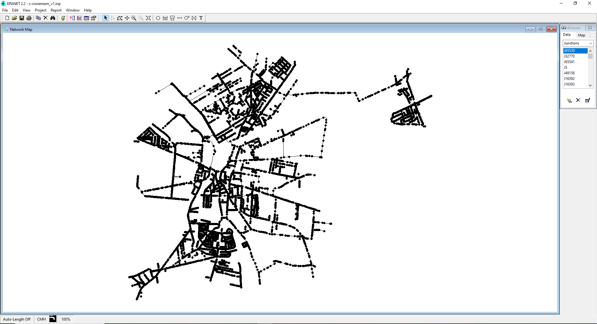

# Analysis of Selected Tools

It was quickly determined that EPANET will be the best tool for the simulation part of the project, so the chapter focuses mainly on EPANET itself and how to use it rather than on the comparison with other simulators. The rest of the project (simulated annealing, machine learning and data analysis) will likely be implemented in Python.

## EPANET (Command line tool)

EPANET provides a command-line tool that allows to run hydraulic simulations directly from the terminal. To run it only single input file needs to be provided. The results of the simulation are then dumped in the report file. It's a very convenient tool to use for automation and for integration with other tools.

The CLI is available on Windows, MacOS and Linux.
To get it running you need to clone the [EPANET](https://github.com/OpenWaterAnalytics/EPANET.git) repo and then build the application with cmake.

```
cd EPANET

cmake -S . -B build
cmake --build build --config Release

PATH="$(pwd)/build/bin/:$PATH"
runepanet --help
```

The `runepanet` executable should appear in the `EPANET/build/bin` folder. (so far tested only on MacOS)

To run the simulation, at least two arguments are required:

1. The first argument is the path to the .inp file (e.g., Hanoi.inp). This file describes the network's topology, node elevations base      demands, and demand patterns for each node. It also includes simulation configurations, such as the duration of the simulation and the type of analysis to be used (e.g., PDA or DDA).

2. The second argument is the name of the output report file that will be generated by the simulation. This is a text file that can be parsed and analyzed. The contents of the report are specified in the .inp file.

3. The third argument is optional. It is the name of the output binary file, which contains additional information about the simulation. (Contains simulation data in a more compact format, combined with some other tool it may simplify and speeden up the data loading process,though this topic requires more thorough research)

Let's for example analyze the configuration file for Hanoi.inp

```
[JUNCTIONS]
;ID              	Elev        	Demand      	Pattern         
 2               	30          	247.22      	                	;
 3               	30          	236.11      	some_pattern        ;
 ```
 The first line has information about a node id, its elevation and base demand.
 The pattern argument was empty for all nodes in this particular network, meaning no demand pattern is applied. However, if it was there it would look like the one in the last line. This some_pattern is not defined directly in the JUNCTIONS section but refers to a separate section in the configuration file (the [PATTERNS] section). Here, the demand at node 3 will be modified over time according to the values defined in the pattern.

 ```
[PATTERNS]
;some_pattern       Multipliers
some_pattern        1.0 1.2 1.5 1.0 0.8 0.5
 ```

This pattern will multiply the base demand by the corresponding factor at each time step during the simulation. At time step 1, the demand will be multiplied by 1.0, at time step 2 by 1.2, and so on. This allows to model changing demands at certain nodes.

The next important part are the configurations, here we define what time period should be simulated, and how frequently should the measurments be reported..

```
[TIMES]
 Duration           	12:00 
 Hydraulic Timestep 	0:10 
 Quality Timestep   	0:05 
 Pattern Timestep   	1:00 
 Pattern Start      	0:00 
 Report Timestep    	0:10 
 Report Start       	0:00 
 Start ClockTime    	12 am
 Statistic          	NONE
 ```


 To specify what exactly we want reported the [REPORT] section needs to be modified.
 ```
 [REPORT]
 Status             	No
 Summary            	Yes
 Page               	0
 Nodes                  ALL
 Link                   NONE
 Pressure               Yes
```
The configuration above reports pressure measurments for all nodes (suitable for our project).

```
[OPTIONS]
 Demand Model           PDA
 Units              	LPS
 Headloss           	H-W
 Specific Gravity   	1
 Viscosity          	1
 Trials             	40
 Accuracy           	0.000001
 Unbalanced         	Continue 10
 Pattern            	1
 Demand Multiplier  	1.0
 Emitter Exponent   	0.5
 Quality            	None mg/L
 Diffusivity        	1
 Tolerance          	0.01
 ```

The [OPTIONS] part defines some other simulations configurations, all of the above configurations were copied from the `Hanoi.inp` file, except the Demand Model argument. For our case it's crucial that this parameter is set to PDA instead of the default DDA. (the explanation why, [below](#pda-vs-dda))

## EPANET (GUI Application)


EPANET also comes with GUI application, which is unfortunately available only for Windows. It allows to run simulations and simultaneously visualize them.



The network was read from the .inp file. The above WDN has over 8500 nodes and over 8700 pipes, the GUI can handle such large graphs quickly. It is possible to set needed configurations directly in the application.

While the GUI is a useful tool for visualizing and manually configuring networks, it's not really suitable for automation and integration with other tools, so it probably won’t be used extensively

## EPANET (Running on Cyfronet)

The command line tool can also be run on `Cyfronet`, there is an epanet2.3 module already available.
Below is the example for `Ares`.

```
#!/bin/bash -l

#SBATCH --job-name run_epanet_simulation
#SBATCH --time=00:10:00

#SBATCH --ntasks=1
#SBATCH --mem=8G

#SBATCH --partition=<partition>
#SBATCH --account=<account>

module load epanet/2.3.0-gcc-13.2.0
runepanet input.inp report.rpt binary.bin
```

The script needs to be run with `sbatch` command.


## Python's EPANET API (epyt)

A Python library, `epyt`, is also available through the official Python Package Index (PyPI) and can be installed via `pip`. It is compatible with all systems and includes precompiled binaries, allowing it to be used without requiring EPANET to be installed.
Short usage example can be found [here](../notebooks/epyt_demo.ipynb).


## PDA vs DDA

The explanation will be here ... (someday)


## Final Thoughts and Future Directions

...
