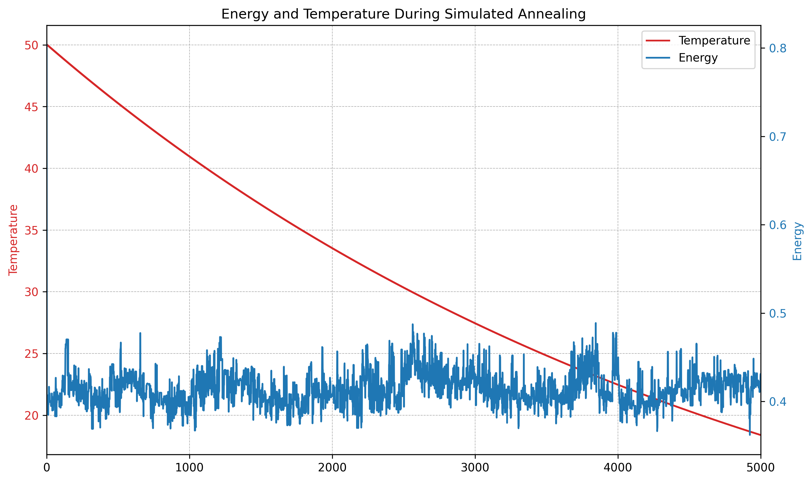
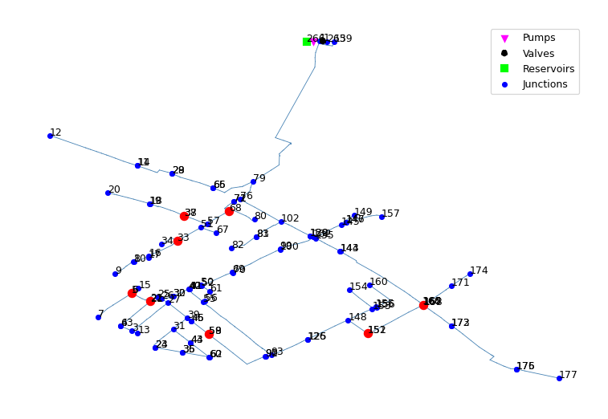

# Completed Functionalities and Initial Results

By the end of this milestone, we successfully completed all steps of our pipeline. The main stages included running hydraulic simulations on an HPC cluster and applying a simulated annealing algorithm to determine the optimal placement of leakage detectors.

## Running the Simulations

Simulations were conducted to generate realistic data that reflect the behavior of the water distribution network (WDN) under various conditions, particularly to simulate leakages at different nodes.

Our assumption was that at any arbitrary time, a leakage could occur at a single node. This assumption supports our leakage detection approach, which is based on a nearest-neighbor classification model — each class corresponding to a node in the network.

To train and validate the classifier, we needed multiple simulation runs per node, each simulating various leakage magnitudes. Every simulation required a separate input file, all of which shared a common configuration: the network topology, general parameters of the WDN, and the format for the output report. The varying component across input files was the leakage configuration, which was simulated by increasing the demand at specific nodes.

Since each simulation was independent and produced its own report, the task was highly parallelizable. We utilized the Ares HPC cluster at Cyfronet to run these simulations. For this checkpoint, we focused on the Kleszczów WDN, which has over 100 nodes. We simulated 20 leakage scenarios per node, resulting in approximately 2200 total simulation reports.

To efficiently manage this workload, we allocated 100 compute nodes, each responsible for about 22 simulations. With each simulation averaging around one minute, the entire batch job completed in roughly 20 minutes.

## Simulated Annealing for Sensor Placement

The next stage involved using a simulated annealing (SA) algorithm to determine the optimal placement of `n` leakage detectors in the network. The objective was to minimize the leak localization error..

The key components of the simulated annealing process were:

- **Neighbor-generating function**: This function perturbed the current solution by swapping a selected node with one of its neighbors in the network.
- **Evaluation function**: Each candidate solution (set of sensor locations) was evaluated by:
  1. Training a k-Nearest Neighbors (k-NN) classifier on the training set.
  2. Testing it on the validation set to measure leak localization accuracy.

The evaluation metric was the leak localization error described in the paper *"Pressure Sensor Placement for Leak Localization Using Simulated Annealing with Hyperparameter Optimization"*. The k-NN classifier used pressure residuals as input features, with each class representing a possible leak location (i.e., a node in the network).

Below is the plot of the energy and templerature during the algorithm.



For the algorithm i used following configuration:

```json
{
    "solution_size": 8,
    "knn_neighbors": 5,
    "knn_d_max": 20,
    "epochs": 500,
    "steps_per_epoch": 10,
    "initial_temperature": 50.0,
    "temperature_decay": 0.99
}
```

After running the algorithm we got the following solution (the chosen nodes are highlithed red)



The computation itself took only about 2 minutes, so it is not the most computationaly extensive part of the pipeline.