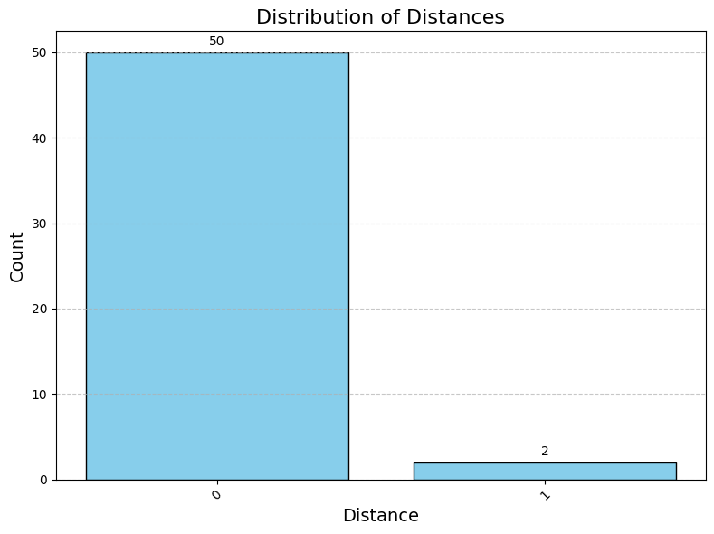
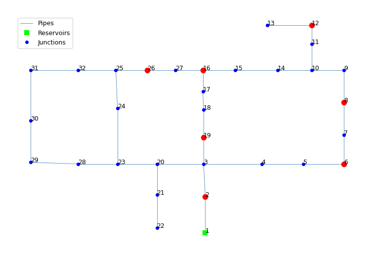
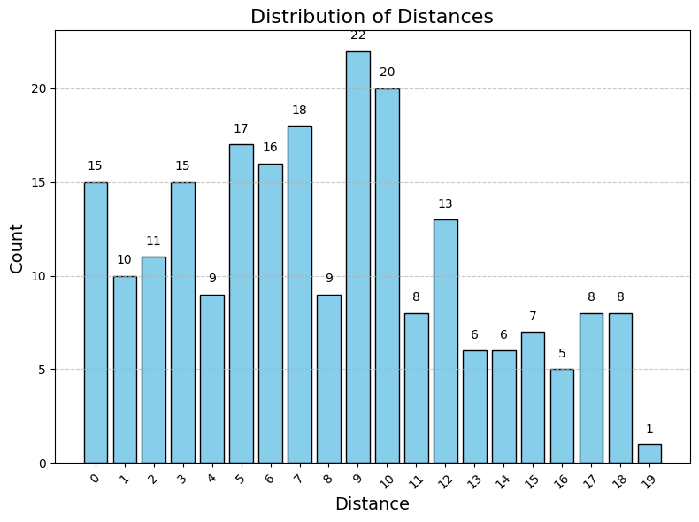
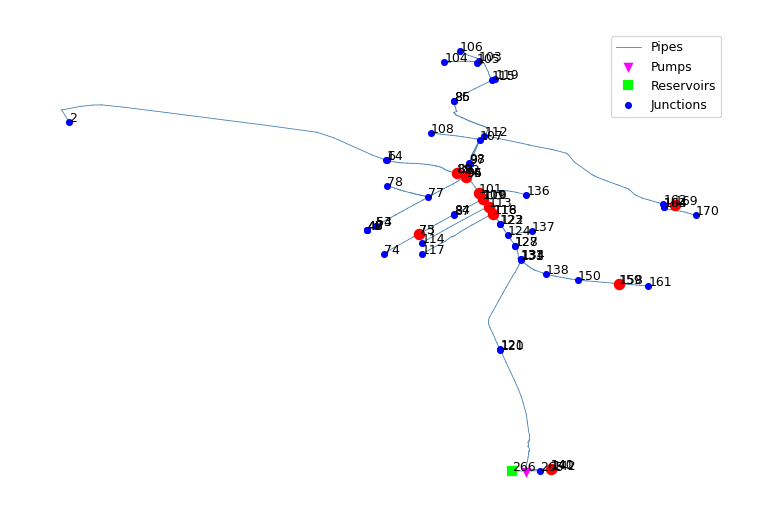
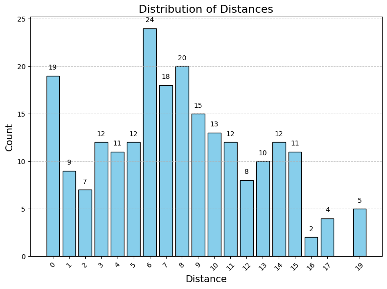
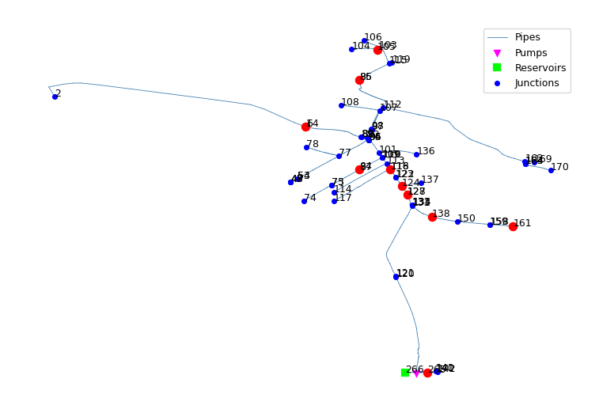
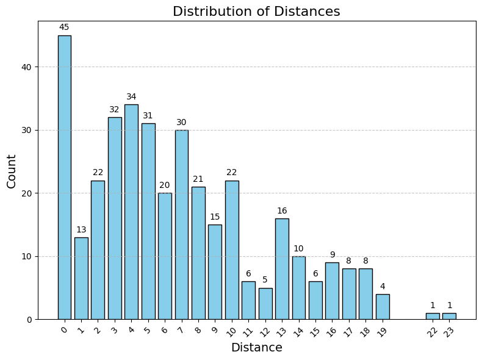
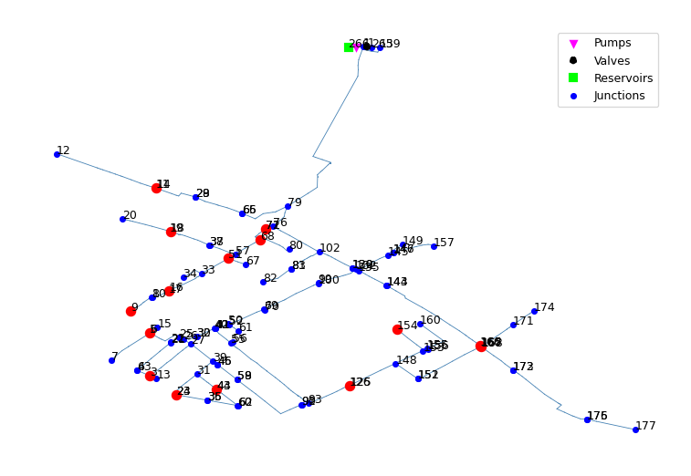
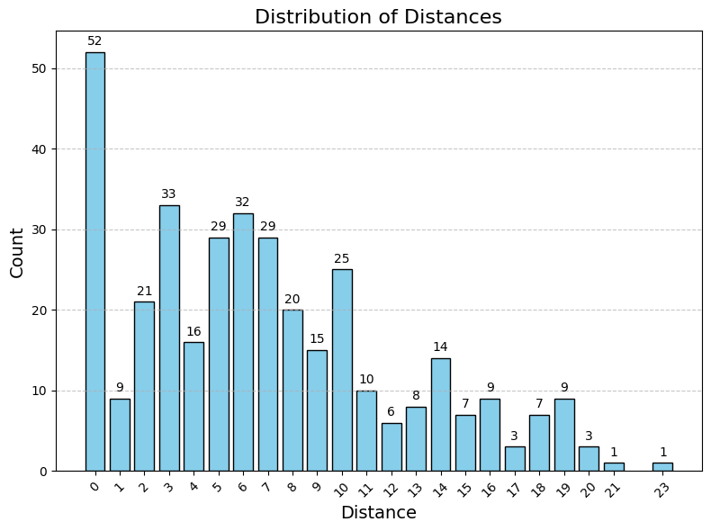
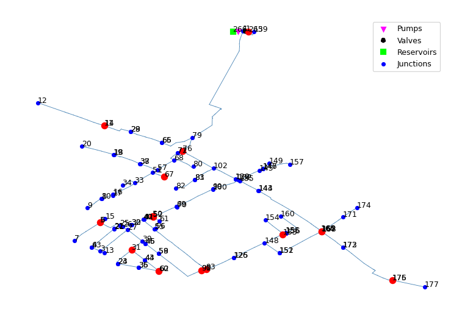

# Results analysis

By the end of the previous milestone, we successfully completed all steps of our pipeline. The main stages included:

- Running hydraulic simulations on an HPC cluster  
- Applying a simulated annealing algorithm (combined with KNN classification) to determine the optimal placement of leakage detectors

With the simulation outputs now available, we are moving into the **parametric study** phase. This stage will involve comparing various configurations to evaluate performance. Specifically, we will examine:

- Different values of key hyperparameters, such as `solution size`
- Multiple classification algorithms, each with their own hyperparameter settings

All tests will be conducted on the following networks:

- **Hanoi**
- **Kleszczów**
- **Taciszów**

## Evaluation metrics

In the evaluation phase, we aim to assess the quality of the predicted results. However, standard classification accuracy (treating predictions as simply correct or incorrect) is not suitable for our case. Since we are predicting nodes in a graph, the spatial relationship between the predicted and actual nodes must be taken into account.

For example, a prediction that is **one hop away** from the correct node is clearly more accurate than one that is **ten hops away**. Therefore, our evaluation metrics must reflect this notion of *proximity* within the graph.

The cost function used in the simulated annealing algorithm (described in [Checkpoint 4 & 5](checkpoint4&5.md)) already incorporates graph distances. However, it relies on a parameter called `dist_max`, which caps the penalty for distant predictions. This design prevents the loss function from being overly influenced by a small number of poor predictions. 

While this is useful during optimization, it introduces variability across runs with different hyperparameter settings, making results **not directly comparable**.

To address this, we introduce a few simple, consistent evaluation metrics designed to fairly compare different parameter configurations and classification algorithms, regardless of the values used during optimization.


### Mean Predicted Distance

This metric calculates the average number of hops between the predicted node and the actual (ground truth) node across all test cases.
The **Mean Predicted Distance** is defined as:

$$
MPD = \frac{1}{N} \sum_{i=1}^{N} d(\hat{y}_i, y_i)
$$

Where:

- $N$ be the number of test cases,
- $\hat{y}_i$ be the predicted node for sample $i$,
- $y_i$ be the true node for sample $i$,
- $d(\hat{y}_i, y_i)$ be the shortest-path distance between $\hat{y}_i$ and $y_i$ in the graph.

This metric captures how close, on average, the predictions are to the true nodes. The lower the metric value, the better the classifier (perfect value would be zero).

### Weighted Accuracy

In addition to the Mean Predicted Distance, we also use a **Weighted Accuracy** metric that assigns more credit to predictions that are closer to the correct node. 

We apply an **exponential decay function** to the distance between the predicted and true node. This way, closer predictions receive higher scores, while distant predictions are penalized more heavily.


Then the **Weighted Accuracy** is defined as:

$$
WA_{\lambda} = \frac{1}{N} \sum_{i=1}^{N} e^{-\lambda \cdot d(\hat{y}_i, y_i)}
$$

Where:
- $N$ be the number of test cases,
- $d(\hat{y}_i, y_i)$ - the distance between the predicted node $\hat{y}_i$ and the true node $y_i$,
- $\lambda$ be the **decay factor** (a positive constant controlling how quickly the weight decreases with distance), in our case it was chose to be 0.4

This metric has following features:
- A prediction exactly on the correct node contributes $1$ to the sum.
- A prediction one hop away contributes $e^{-\lambda}$, and so on.
- Higher $\lambda$ values penalize distance more sharply.


### Histogram of distances

We also use a visual metric — a histogram of the distances between the true and predicted nodes. This histogram provides insight into the distribution and variance of prediction errors.

A well-performing classifier should produce a distribution that is skewed to the left, with a strong concentration of predictions at zero distance (i.e., correct predictions). A long right tail or a spread-out distribution may indicate inconsistency or lower spatial accuracy in the model's predictions.


## Hanoi Analysis

The hyperaparameters for the Hanoi network were:

- `solution_size` - number of nodes with pressure sensors,
- `d_max` - parameter in the loss function
- `n_neigbhors` - number of nearest neighbors in the knn algorithm
- `metric` - metric in the knn

For the parameters we've chosen following values,

```json
{
    "solution_size": [2, 4, 7],
    "d_max": [5, 7],
    "n_neighbors": [3, 5, 7],
    "metric": ["minkowski", "euclidean", "manhattan"]
}
```

Then the grid search was performed. In the grid search the best value of mean dist metric was achieved with the forllowing set of parameters,

```json
{
    "solution_size": 7,
    "d_max": 7,
    "n_neighbors": 3,
    "metric":  "euclidean"
}
```

The value of `mean distance` was $0.038$ and the value of `weighted accuracy` was $0.98$.
The similar results were also achieved when using decision tree as the algorithm.

The distribution of predictions was following.



And the optimal placement tourned out to be




## Taciszów Analysis

Similar experiments were run for Taciszow netowork. However since the Taciszow WDN is larger than the Hanoi one, for the metric i used only the euclidean one.

```json
{
    "solution_size": [5, 10, 15],
    "d_max": [5, 10],
    "n_neighbors": [3, 5, 7],
    "metric": ["euclidean"]
}
```

Interestingly, the best solution was obtained with a `solution size` of **10**, `d_max` **10** and **3** `neareast neighbors`.
The best mean distance was $7.94$ and the corresponding weighted accuracy was $0.17$






I also run the experiments with the decision tree algorithm.
The results obtained were slightly better: \
Mean distance: $7.78$ \
Weighted accuracy: $0.18$






## Kleszczów Analysis


The last network was Kleszczów. The exact same expermients were run.
For KNN the optimal `solution_size` was 15. \
The metrics had values: \
Mean distance: $6.70$ \
Weighted accuracy: $0.25$





For the decision tree algorithm the results were slighlty worse in this case: \
Mean distance: $6.91$ \
Weighted accuracy: $0.25$






